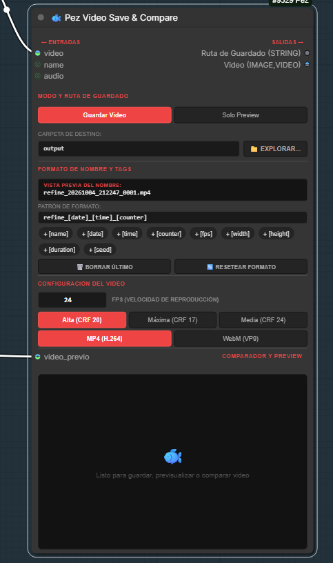
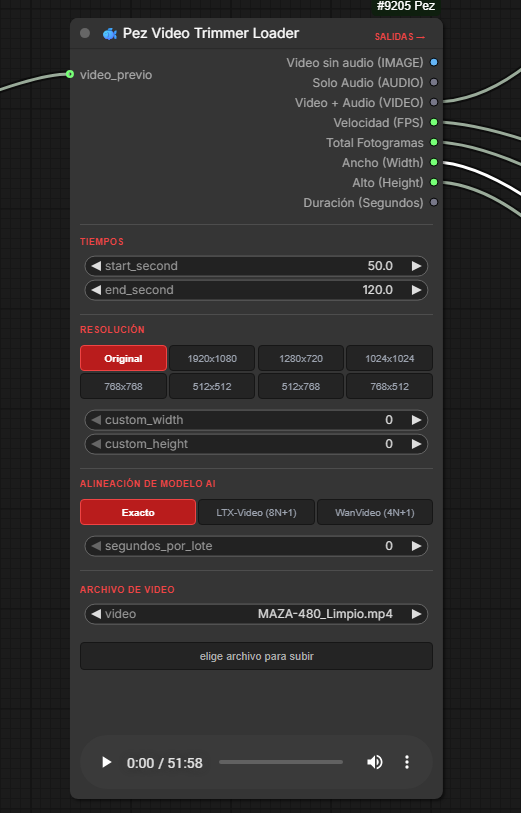
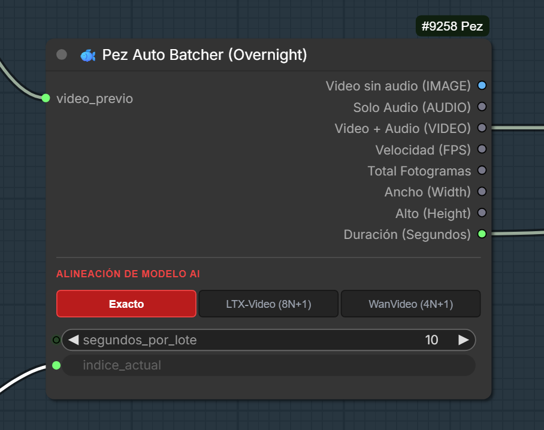
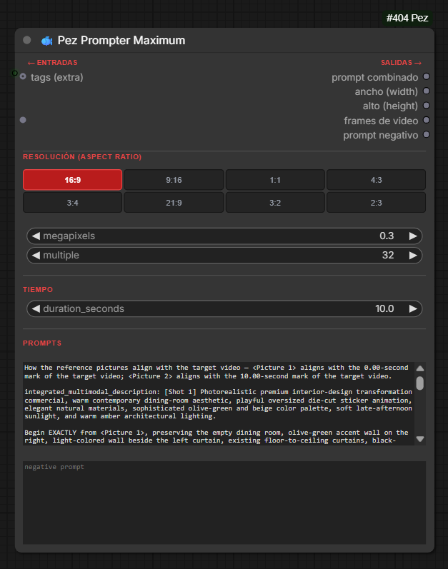
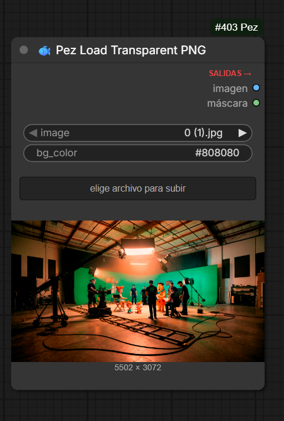
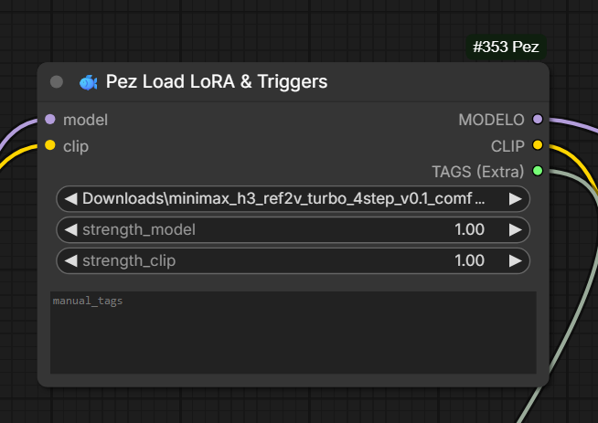

# ComfyUI-PezNodes 🐟
**Versión Actual:** v1.3.1

Una suite completa de nodos personalizados para **ComfyUI** diseñada para potenciar y agilizar flujos de trabajo de video y animación generativa (especialmente optimizados para modelos como **MiniMax H3**, **LTX-Video**, **Wan 2.1**, **HunyuanVideo** y modelos de imagen como **SDXL** y **Flux**).

---

## 📦 Nodos Incluidos

### 1. 🐟 Pez Video Trimmer
El nodo definitivo para cargar, previsualizar, recortar y redimensionar video con precisión milimétrica directamente dentro del lienzo de ComfyUI.

**Características principales:**
- **Reproductor nativo integrado:** Previsualiza el video seleccionado directamente en el nodo.
- **Recorte temporal exacto:** Define puntos de inicio (`start_second`) y final (`end_second`) en segundos con soporte decimal.
- **Botonera interactiva de Resolución:** Presets de un solo clic (`Original`, `1920x1080`, `1280x720`, `1024x1024`, `768x768`, `512x512`, `512x768`, `768x512`) y campos de ancho/alto personalizados (`custom_width`, `custom_height`).
- **Alineación de Modelos de IA:** Ajusta automáticamente los fotogramas del lote según la arquitectura del modelo de video:
  - `Exacto`: Corte cronológico estándar.
  - `LTX-Video (8N+1)`: Ajuste matemático para modelos que requieren múltiplos de 8 más 1 frame.
  - `WanVideo (4N+1)`: Ajuste matemático para modelos Wan que requieren múltiplos de 4 más 1 frame.
- **Botón estilizado de carga:** Botón interactivo para subir videos desde el explorador con iluminación dinámica al pasar el cursor.
- **Salidas múltiples:** Entrega video sin audio (`IMAGE`), solo audio (`AUDIO`), video combinado (`VIDEO`), FPS nativo, fotogramas totales, dimensiones (`Width`, `Height`) y duración exacta.

---

### 2. 🐟 Pez Auto Batcher (Overnight)
Diseñado para la generación y renderizado por lotes desatendidos ("overnight"). Divide videos largos en fragmentos correlativos exactos sin pérdida de cuadros ni desfases de audio.

**Características principales:**
- **Troceado automático:** Define la duración de cada lote (`segundos_por_lote`) e itera secuencialmente conectando un nodo Primitive en modo *increment* a `indice_actual`.
- **Sincronización milimétrica:** Calcula los cortes basándose en los fotogramas reales y la tasa de refresco (FPS) del video para que cada lote empiece exactamente donde terminó el anterior.
- **Alineación de Motores AI:** Presets interactivos (`Exacto`, `LTX-Video 8N+1`, `WanVideo 4N+1`) para garantizar que cada lote cumpla con los requisitos estructurales de los modelos de difusión de video.

---

### 3. 🐟 Pez Prompter Maximum
El centro de control maestro para estructurar prompts, dimensiones y duración de video sin saturar el flujo de trabajo con nodos auxiliares.

**Características principales:**
- **Resolución (Aspect Ratio) con botones:** Cuadrícula interactiva 4x2 (`16:9`, `9:16`, `1:1`, `4:3`, `3:4`, `21:9`, `3:2`, `2:3`) con selección activa en rojo (`16:9` por defecto).
- **Cálculo automático de dimensiones:** Convierte el *Aspect Ratio* seleccionado y el valor de *Megapíxeles* (ej. 0.4 para video, 1.0 para SDXL, 2.0 para alta definición) en resolución exacta en píxeles.
- **Múltiplo de compatibilidad universal (`multiple`):** Configurado por defecto en `32`, asegurando compatibilidad matemática absoluta con MiniMax H3, LTX-Video, Wan 2.1, HunyuanVideo y SDXL.
- **Sección independiente de Tiempo:** Controla `duration_seconds` calculando internamente la cantidad exacta de fotogramas requeridos a 24 FPS para MiniMax H3 (`F + (5 - (F % 17)) % 17`).
- **Doble frente de Prompts (Positivo y Negativo):**
  - `PROMPT POSITIVO`: Se combina inteligentemente con las etiquetas provenientes de `extra_tags` agregando comas y espacios limpios.
  - `PROMPT NEGATIVO`: Campo multilínea independiente que pasa intacto a su propia salida `Prompt Negativo`, sin contaminación de tags.
- **Señalización visual limpia:** Indicadores de cabecera `← ENTRADAS` y `SALIDAS →`.

---

### 4. 🐟 Pez Load Transparent PNG
Elimina el problema clásico de los bordes con artefactos o "mordidos" (aliasing) al enviar imágenes PNG con canal alfa a modelos de video o ControlNet.

**Características principales:**
- **Reconocimiento perfecto de transparencia:** Procesa el canal alfa y compone la imagen sobre un fondo sólido configurable (por defecto `#808080` gris neutro).
- **Procesamiento híbrido:** Si la imagen cargada carece de canal alfa (como un JPG estándar), la transmite intacta sin alterar sus dimensiones.
- **Botón de subida estilizado:** Botón DOM con diseño moderno e iluminación en rojo al rollover.
- **Salidas separadas:** Entrega la imagen compuesta (`IMAGE`) y la máscara correspondiente (`MASK`).

---

### 5. 🐟 Pez Load LoRA & Triggers
Reemplazo optimizado para el cargador nativo de LoRA con extracción inteligente de trigger words.

**Características principales:**
- **Extracción de metadatos:** Lee los metadatos internos del archivo (`.safetensors`) extrayendo las palabras disparadoras configuradas durante el entrenamiento (Kohya, Civitai, A1111).
- **Filtro Anti-Duplicados:** Permite añadir etiquetas manuales en `manual_tags`, combinándolas con las del archivo y eliminando repeticiones para no sobresaturar el prompt.
- **Salida directa:** Salida `TAGS (Extra)` lista para conectar al socket `extra_tags` de `Pez Prompter Maximum`.

---

### 6. 🐟 Pez MiniMax Preview
Previsualización de muestreo (sampling) en tiempo real para MiniMax H3.

**Características principales:**
- **Denoising en vivo:** Visualiza cada paso del muestreo sin esperar al render final.
- **Telemetría:** Muestra gráficas de Sigma/Delta (σ/Δ) y tiempo de ejecución por paso.
- **Protección contra desbordamiento:** Detección de fallos numéricos FP16 en resoluciones extremas y conmutación automática de decodificador para evitar pantallas negras.
- **Auto-limpieza:** Mantiene el canvas limpio entre ejecuciones.

---

### 7. 🐟 Pez Video Save & Compare
El nodo definitivo para guardar video con multiplexación de audio, formateo dinámico mediante etiquetas interactivas y reproductor comparativo A/B (Antes vs. Después) con divisor deslizable en tiempo real.

**Características principales:**
- **Preservación total de Workflow (Drag & Drop):** Inyecta automáticamente los metadatos del flujo (`workflow`) y árbol de generación (`prompt`) dentro del archivo MP4/WebM. Al arrastrar el video generado a cualquier ventana de ComfyUI (en cualquier PC), el lienzo reconstruye el flujo exacto al 100%.
- **Compatibilidad universal de entrada (`IMAGE,VIDEO`):** Acepta directamente secuencias de fotogramas (`IMAGE`) o streams nativos de video (`VIDEO` de LTX-Video Decode). Desempaqueta automáticamente fotogramas, framerate y audio embebido del stream.
- **Entradas completas:** Recibe el video (`video`), audio opcional (`audio`), nombre base (`name`) y video previo opcional (`video_previo`).
- **Salida dual en cadena:** Entrega la `Ruta de Guardado (STRING)` y el `Video (IMAGE,VIDEO)` procesado para conectar downstream con otros nodos (como `Pez Video Trimmer`).
- **Modos de Guardado y Explorador:**
  - `Guardar Video`: Codificación de alto rendimiento directamente en la carpeta de destino.
  - `Solo Preview`: Genera previsualización ligera en la carpeta temporal de ComfyUI sin saturar el almacenamiento de disco.
  - Botón interactivo `📁 EXPLORAR...`: Selección nativa de directorio en Windows.
- **Sistema interactivo de Tags para el Nombre:** Botones de un solo clic para construir nombres ordenados automáticamente:
  - `+ [name]`, `+ [date]`, `+ [time]`, `+ [counter]`, `+ [fps]`, `+ [width]`, `+ [height]`, `+ [duration]`, `+ [seed]`.
  - Botones de acción: `🗑️ BORRAR ÚLTIMO` y `🔄 RESETEAR FORMATO`.
  - **Vista previa dinámica en tiempo real:** Muestra exactamente cómo se llamará el archivo antes de pulsar la cola de ejecución.
- **Configuración de Video con Botones:**
  - Selector de Calidad: `Alta (CRF 20)`, `Máxima (CRF 17)`, `Media (CRF 24)`.
  - Selector de Formato: `MP4 (H.264)` y `WebM (VP9)`.
  - Selector de FPS: Campo numérico interactivo con flechas y soporte decimal.
- **Reproductor con Comparador A/B (Antes / Después):**
  - Si solo se conecta `video`: Reproductor de video integrado con controles nativos y reproducción en bucle.
  - Si se conecta `video_previo`: Activa la vista dividida interactiva con línea vertical roja (`◀▶`) deslizable en tiempo real mediante máscara `clip-path`, sincronizando ambos videos al 100% de escala sin deformaciones ni reescalados.
- **Distribución ergonómica de slots:** La entrada `video_previo` se sitúa en la parte inferior, directamente alineada con el visor comparativo.

---

## 🚀 Instalación

1. Navega al directorio de nodos personalizados de tu instalación de ComfyUI:
   ```bash
   cd ComfyUI/custom_nodes/
   ```
2. Clona este repositorio:
   ```bash
   git clone https://github.com/unpezcado/ComfyUI-PezNodes.git
   ```
3. Reinicia tu servidor de ComfyUI. Los nodos aparecerán organizados bajo la categoría **Pez**.

---

## 📋 Historial de Versiones

- **v1.3.1:**
  - **Corrección crítica de metadatos de Workflow:** Ahora todos los videos guardados (MP4 y WebM), ya sea mediante guardado directo o desde el botón de la previsualización, integran los metadatos completos de `workflow` y `prompt` mediante especificación estándar `FFMETADATA1` y etiquetas de contenedor (`moov.udta.meta.keys/ilst` y EBML Tags).
  - Permite arrastrar el archivo de video generado a cualquier instalación de ComfyUI (en la misma máquina o en cualquier otra computadora) y reconstruir instantáneamente el flujo de trabajo completo.

- **v1.3.0:**
  - Nuevo nodo: **`Pez Video Save & Compare`** (`🐟 Pez Video Save & Compare`): guardado de video con multiplexación de audio, formateo interactivo y comparador A/B.
  - Soporte de entrada y salida híbrida (`IMAGE,VIDEO`): compatibilidad directa con nodos de video como **LTX-Video** (`Decode`) y generadores basados en tensores `IMAGE`. Extracción automática de frames, FPS y pistas de audio embebidas.
  - Salida dual (`Ruta de Guardado (STRING)`, `Video (IMAGE,VIDEO)`) para encadenar downstream en flujos complejos.
  - Constructor dinámico de nomenclatura de archivos mediante botones de tags (`[name]`, `[date]`, `[time]`, `[counter]`, `[fps]`, etc.) con vista previa instantánea del nombre.
  - Reproductor y comparador visual deslizante A/B (Antes vs. Después) con recorte CSS (`clip-path: inset()`) y manija de arrastre `◀▶` en tiempo real.
  - Botón interactivo `📁 EXPLORAR...` para selección de directorios con el explorador nativo del sistema.
  - Distribución ergonómica de slots en canvas: alineación de la entrada `video_previo` con la sección de previsualización.

- **v1.2.0:**
  - Nuevo nodo: **`Pez Video Trimmer`** con reproductor integrado, recorte milimétrico, botonera de resolución y presets de motores AI (`Exacto`, `LTX-Video`, `WanVideo`).
  - Nuevo nodo: **`Pez Auto Batcher (Overnight)`** para renderizado desatendido por lotes y sincronización exacta de frames/audio.
  - Rediseño mayor de **`Pez Prompter Maximum`**: botonera de Aspect Ratio, sección separada de `TIEMPO`, soporte de `PROMPT NEGATIVO` con salida dedicada y protección contra desplazamiento de valores al recargar flujos.
  - Actualización de **`Pez Load Transparent PNG`** con botón de subida estilizado interactivo.
  - Nueva arquitectura de extensiones web en JavaScript (`web/`) con interfaz unificada, líneas divisorias, títulos estandarizados en rojo (#ef4444) e iluminación al rollover.
  - Registro de módulos centralizado en `__init__.py`.

- **v1.1.1:**
  - Corrección de `Pez MiniMax Preview`: Captura dinámica del ID en el canvas y protección contra "Pantalla Negra" (NaN / FP16 Overflow detect).

- **v1.1.0:**
  - Integración de `Pez Load LoRA & Triggers` y `Pez Prompter Maximum` con cálculo de frames para MiniMax H3.

- **v1.0.0:**
  - Lanzamiento inicial con `Pez Load Transparent PNG` y `Pez MiniMax Preview`.

---

## 📸 Screenshots

A continuación se muestran capturas de los nodos en acción dentro de ComfyUI:

### 🐟 Pez Video Save & Compare


### 🐟 Pez Video Trimmer


### 🐟 Pez Auto Batcher (Overnight)


### 🐟 Pez Prompter Maximum


### 🐟 Pez Load Transparent PNG


### 🐟 Pez Load LoRA & Triggers

